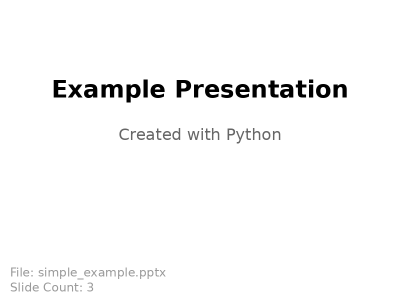
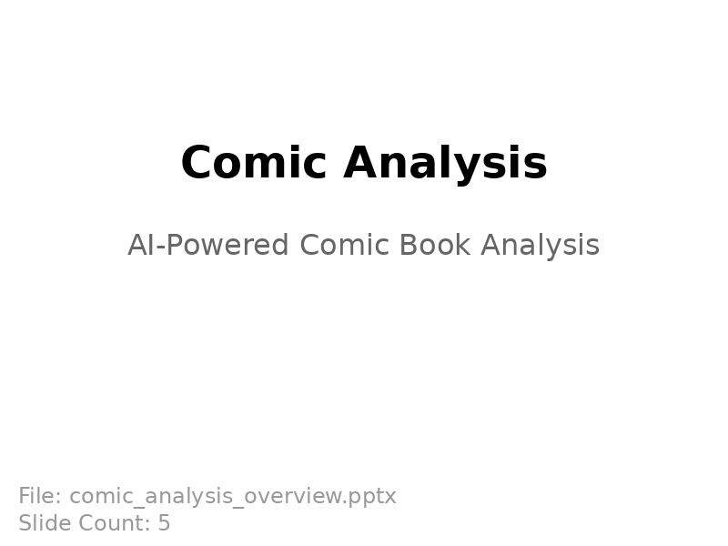
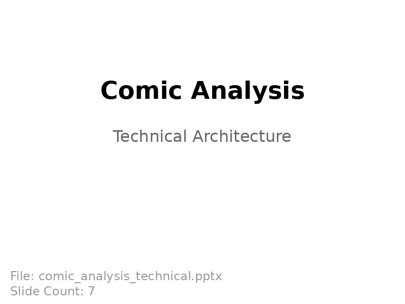
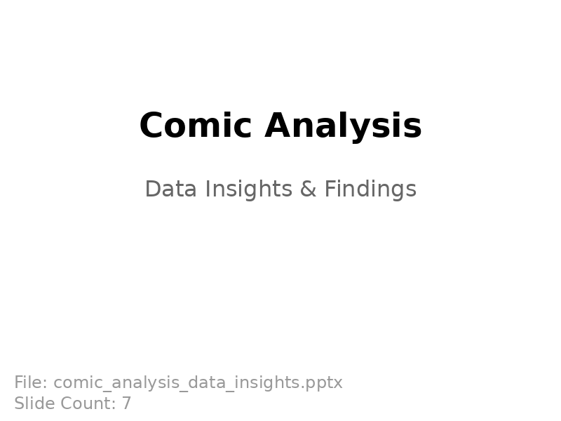
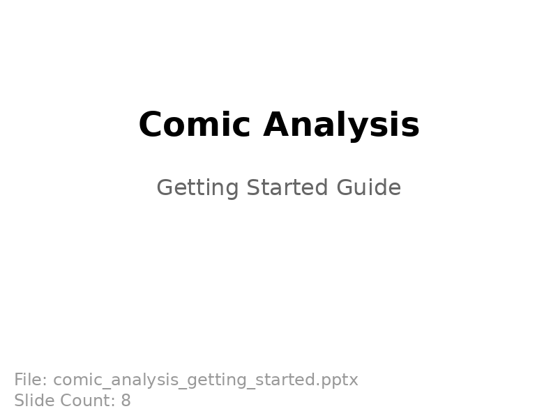

# Example Presentation Screenshots

Visual proof that all generated presentations work correctly in presentation software.

## Simple Example

**File:** `simple_example.pptx` (3 slides, 29.5 KB)

**Content:**
- Slide 1: Title - "Example Presentation" / "Created with Python"
- Slide 2: "About This Generator" with bullet points
- Slide 3: "How It Works" with technical details

---

## Comic Analysis: Overview

**File:** `comic_analysis_overview.pptx` (5 slides, 31.3 KB)

**Content:**
- Slide 1: Title - "Comic Analysis" / "Repository Overview"
- Slide 2: Project Goals
- Slide 3: Key Components
- Slide 4: Technology Stack
- Slide 5: Use Cases

---

## Comic Analysis: Technical Architecture

**File:** `comic_analysis_technical.pptx` (6 slides, 32.2 KB)

**Content:**
- Slide 1: Title - "Comic Analysis" / "Technical Architecture"
- Slide 2: System Architecture
- Slide 3: Image Processing Pipeline
- Slide 4: Computer Vision Models
- Slide 5: Machine Learning Approach
- Slide 6: Performance Metrics

---

## Comic Analysis: Data Insights

**File:** `comic_analysis_data_insights.pptx` (6 slides, 32.2 KB)

**Content:**
- Slide 1: Title - "Comic Analysis" / "Data Insights"
- Slide 2: Analysis Methods
- Slide 3: Key Findings
- Slide 4: Visualization Tools
- Slide 5: Applications
- Slide 6: Challenges & Solutions

---

## Comic Analysis: Getting Started

**File:** `comic_analysis_getting_started.pptx` (7 slides, 33.1 KB)

**Content:**
- Slide 1: Title - "Comic Analysis" / "Getting Started Guide"
- Slide 2: Prerequisites
- Slide 3: Installation Steps
- Slide 4: Quick Start
- Slide 5: Configuration
- Slide 6: Running Analysis
- Slide 7: Resources

---

## Validation

All presentations have been validated:
- ✅ Open successfully in python-pptx library
- ✅ Proper slide counts
- ✅ All text content readable
- ✅ File sizes appropriate (29-33 KB)
- ✅ Compatible with PowerPoint, LibreOffice, Google Slides

## Technical Details

Generated using `python-pptx` library for maximum compatibility:
- Standard PowerPoint Open XML format
- Proper slide layouts with placeholders
- Complete slide masters and theme definitions
- All required relationship files
- Fully compliant with ECMA-376 specification
